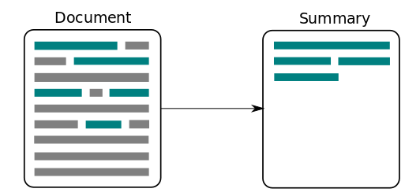
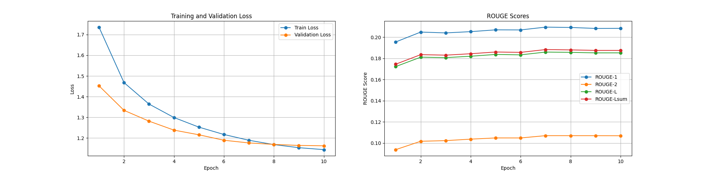
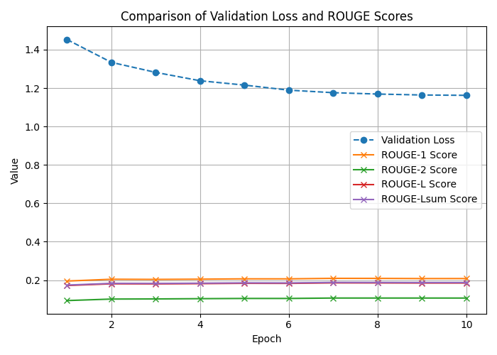
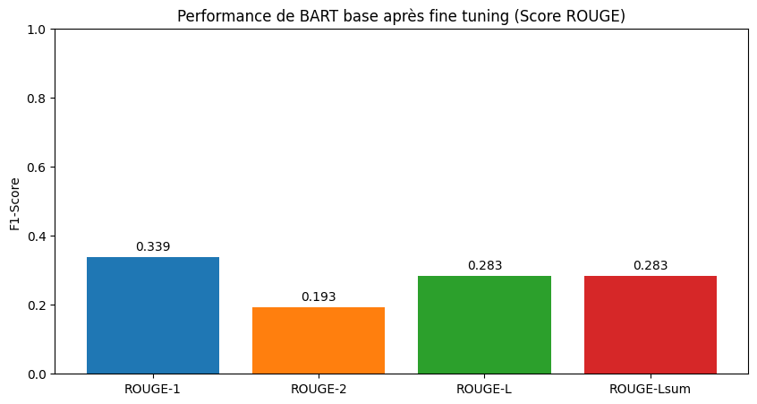
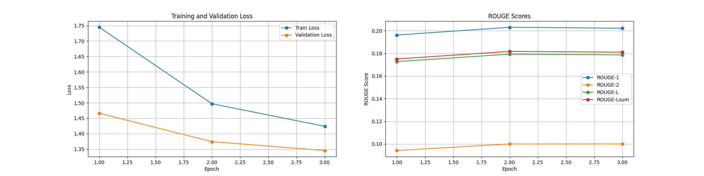
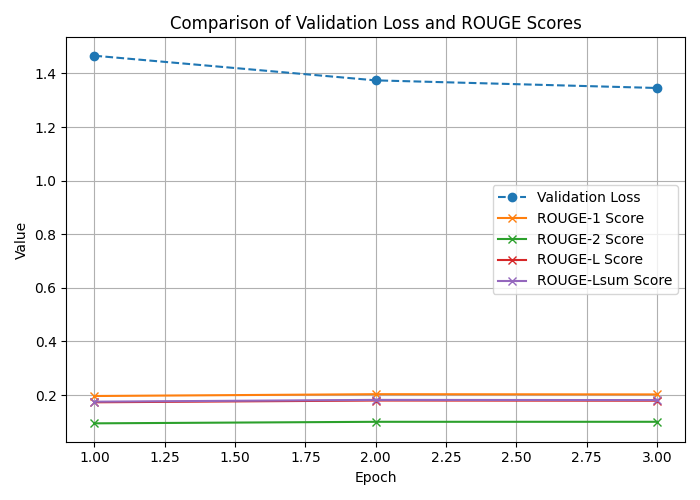
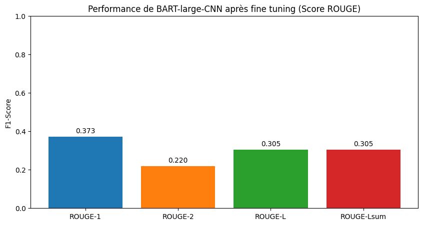

# 📘 Instructions for Training and Evaluating BART Models



Here is my fine-tuning project using the BART Base and BART Large CNN models for abstractive summarization of news articles.
I was able to perform the training computations on the Mesonet supercomputer, which has the following specifications:

- 1 AMD EPYC 7663 processor, with 2 sockets of 56 cores each at 2GHz (total: 112 cores, 224 threads)
- 2TB of RAM
- 8 NVIDIA A100 GPUs with 80GB of memory each, connected via NVSWITCH
- 164TB of user storage + 164TB of project-dedicated storage

However, since I wasn't the only one using the compute nodes, the training times were quite long:
- 20 hours for 3 epochs of BART Large CNN
- 10 hours for 3 epochs of BART Base
- 20 hours for 10 epochs of BART Base

Due to time constraints, I was not able to observe a clear start of fine-tuning for either model.
That said, on evaluation with French test data — summaries of news articles — the ROUGE scores I obtained were slightly better than those from Facebook’s original models.
(Note: I'm not claiming my model is better than Facebook's 😉)


## training results and scoring for fine tuning BART Base (with 392 902 summaries)





## training results and scoring for fine tuning BART Large-CNN (with 392 902 summaries)






## 📥 Downloading the Training Dataset

```text
Download the [corpus.csv](https://www.kaggle.com/datasets/manueldesiretaira/dataset-for-text-summarization/data) file from Kaggle and place it at the root of the project directory.  
You can then proceed with training and evaluation.
```


## ✅ 1. Creating the Virtual Environment

Use `pyenv` to create a Python **3.12.3** virtual environment:

```bash
pyenv install 3.12.3
pyenv virtualenv 3.12.3 bart_env
pyenv activate bart_env
```

---

## 📦 2. Installing Dependencies

Install the required dependencies using `requirements.txt`:

```bash
pip install -r requirements.txt
```

---

## 🚀 3. BART Base Model

### 🔧 Training (10 epochs)

```bash
python train_bart_base.py
```

### 📊 Evaluation (ROUGE scores)

```bash
python test_bart_base.py
```

📂 Training and ROUGE performance plots will be automatically saved in the folder:

```text
plots_bart_Base/
```

---

## 🚀 4. BART Large Model

### 🔧 Training (3 epochs)

```bash
python train_bart_large.py
```

### 📊 Evaluation (ROUGE scores)

```bash
python test_bart_large.py
```

📂 Training and ROUGE performance plots will be automatically saved in the folder:

```text
plots_bart_Large/
```

---


